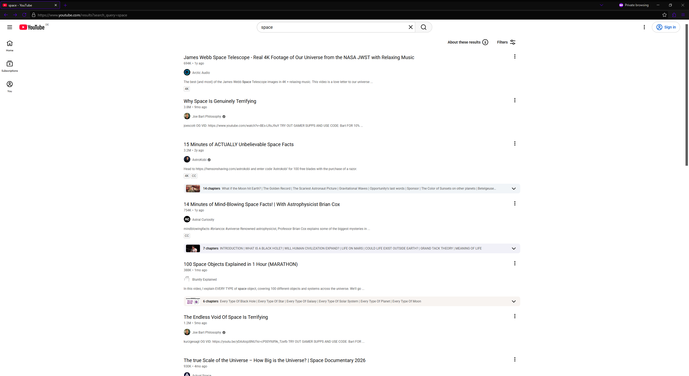

# YouTube & Twitch userscripts

Features can be enabled/disabled via the `config` object. As written in the scripts, some features are based on other scripts, which I often have rewritten quite a lot to be more efficient.

You can use these scripts via e.g. [violentmonkey](https://github.com/Violentmonkey/Violentmonkey) (New > New from file).

## Twitch

- Ad blocking 
- Background playback
- Remove carousel media
- Hide Bits/Prime promotions & extension banners
- Hide sidebar Stories & recommended categories
- Hide Whispers, Notifications, Subscribe, Gift a Sub

## YouTube

- Automatic theater mode
- SponsorBlock skipping
- Hide thumbnails
- Hide `Voice search`, `+ Create`, `Notifications`, filter chips, `Join` & `Super Thanks`
- Hide `Explore`, `More from YouTube`, `Report history` & sidebar footer links
- Hide/block `Shorts` everywhere

### Preview

